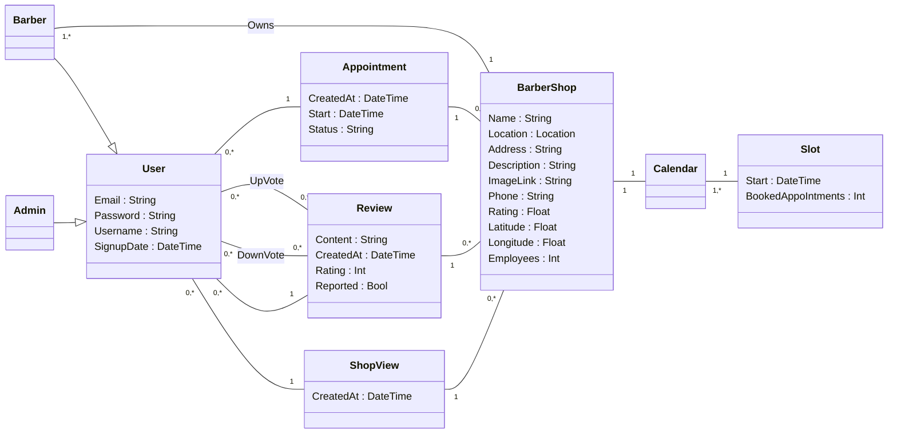

# UML Class diagram

```mermaid
classDiagram
direction LR

	Barber --|> User
	Calendar "1,*"--"1" Slot
	User "0,*"--"0,*" Review : UpVote
	User "0,*"--"0,*" Review : DownVote
	User "0,*"--"1" Appointment
	Barber "1,*"--"1" BarberShop : Owns
	Admin --|> User
	User "0,*"--"1" ShopView
	Appointment "1"--"0,*" BarberShop
	BarberShop "1"--"1" Calendar
	User "0,*"--"1" Review
	Review "1"--"0,*" BarberShop
	
	ShopView "1"--"0,*" BarberShop
	

	class User {
		Email : String
		Password : String
		Username : String
		SignupDate : DateTime
	}

	class Barber

	class Admin

	class BarberShop {
		Name : String
		Location : Location
		Address : String
		Description : String
		ImageLink : String
		Phone : String
		Rating : Float
		Latitude : Float
		Longitude : Float
		Employees : Int
	}

	class Appointment {
		CreatedAt : DateTime
		Start : DateTime
		Status : String
	}

	class ShopView {
		CreatedAt : DateTime
	}
	
	class Slot{
		Start : DateTime
		BookedAppoIntments : Int 
	}

	class Review {
 		Content : String
		CreatedAt : DateTime
		Rating : Int
		Reported : Bool
	}
```