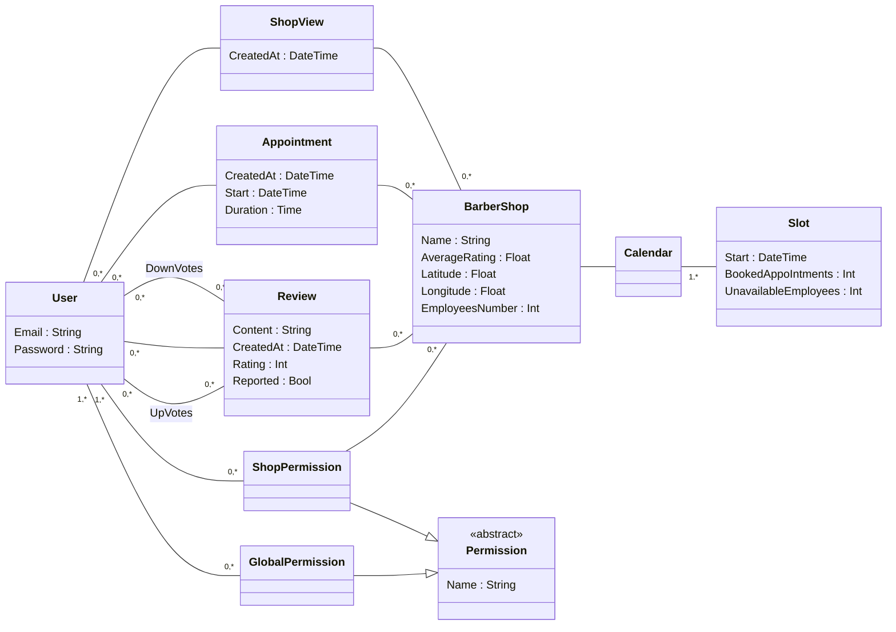

# Class diagram

# For later

Holidays are done only by editing the `UnavailableEmployees` field in the slots.

Only barbers can report reviews, so there is no need for a counter.

Admin will have a view of the reported reviews
