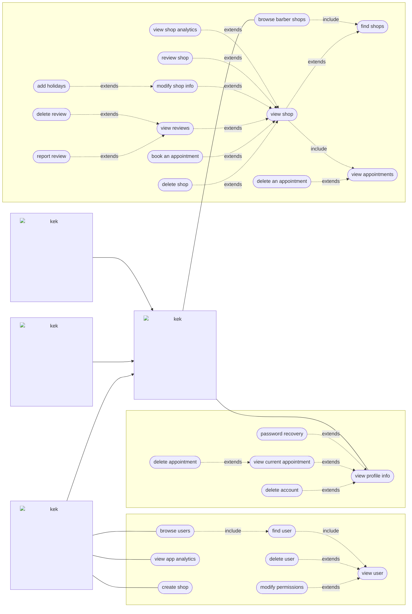

# Use-case diagram

```mermaid
flowchart LR

%% main user
generic_user["<div style='width:200px;height:250px'><img src='stick.png' alt='kek'></div>"]
logged_user["<div style='width:200px;height:250px'><img src='stick.png' alt='kek'></div>"]
barber_user["<div style='width:200px;height:250px'><img src='stick.png' alt='kek'></div>"]
admin_user["<div class='admin' style='width:200px;height:250px'><img src='stick.png' alt='kek'></div>"]

logged_user --> generic_user
barber_user --> generic_user
admin_user --> generic_user

%% admin subgraph

admin_user --- browse_users
admin_user --- user_analytics
admin_user --- create_shop

subgraph  

	%% entities
	browse_users([browse users])
	find_user([find user])
	view_user([view user])
	delete_user([delete user])
	modify_perm([modify permissions])
	user_analytics([view app analytics])
	create_shop([create shop])

	%% relations
	browse_users -.include.-> find_user
	find_user -.include.->view_user
	delete_user-.extends.->view_user
	modify_perm-.extends.->view_user
	user_analytics
	create_shop
end

%% generic shop entities

generic_user --- browse_shops
generic_user ---- view_profile_info

subgraph  

	%% entities
	browse_shops(["browse barber shops"])
	find_shops([find shops])
	view_shop([view shop])
	review([review shop])
	view_reviews([view reviews])
	booking([book an appointment])
	modify_shop([modify shop info])
	add_holidays([add holidays])
	rep_reviews([report review])
	view_appointments([view appointments])
	delete_appointment([delete an appointment])
	view_shop_analytics([view shop analytics])
	delete_shop([delete shop])
	delete_review([delete review])

	%% relations
	browse_shops -.include.-> find_shops
	view_shop -.extends.-> find_shops
	view_shop -.include.-> view_appointments
	delete_appointment -.extends.-> view_appointments
	delete_review -.extends.->view_reviews
	view_shop_analytics -.extends.-> view_shop
	review -.extends.-> view_shop
	rep_reviews -.extends.->view_reviews
	modify_shop -.extends.->view_shop
	add_holidays -.extends.->modify_shop
	view_reviews-.extends.-> view_shop
	booking -.extends.-> view_shop
	delete_shop -.extends.->view_shop
end


%% user profile

subgraph  

	%% entities
	view_profile_info([view profile info])
	pswd_rec([password recovery])
	del_acc([delete account])
	curr_appointment([view current appointment])
	del_appointment([delete appointment])

	%% relations
	pswd_rec -.extends.->view_profile_info
	curr_appointment -.extends.->view_profile_info
	del_acc -.extends.->view_profile_info
	del_appointment-.extends.->curr_appointment
end

class modify_shop barber
class add_holidays barber
class dis_reviews barber
class barber_user barber
class view_appointments barber
class view_shop_analytics adminbarber
class delete_appointment barber
class delete_shop admin
class delete_review admin
class browse_users admin
class find_user admin
class view_user admin
class delete_user admin
class modify_perm admin
class create_shop admin
class user_analytics admin
class rep_reviews barber
class curr_appointment user
class view_profile_info nil
class pswd_rec nil
class del_appointment user
class del_acc barberuser
class browse_shops nil
class find_shops nil
class view_shop nil
class view_reviews nil
class review user
class booking user
class generic_user nil
class logged_user user
class barber_user barber
class admin_user admin

```
