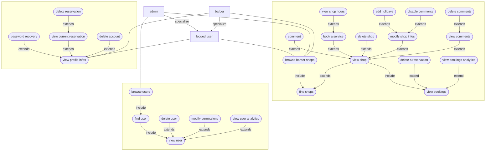

# Use-case diagram

```mermaid
flowchart TB
logged_user[logged user]
browse_shops(["browse barber shops"])
find_shops([find shops])
view_shop([view shop])
comment([comment])
view_comments([view comments])
booking([book a service])
shop_hours([view shop hours])
profile_info([view profile infos])
pswd_rec([password recovery])
curr_reservation([view current reservation])
del_acc([delete account])
del_reservation([delete reservation])
modify_shop([modify shop infos])
add_holidays([add holidays])
dis_comments([disable comments])
view_bookings([view bookings])
delete_reservation([delete a reservation])
view_bookings_analytics([view bookings analytics])

browse_users([browse users])
find_user([find user])
view_user([view user])
delete_user([delete user])
modify_perm([modify permissions])
user_analytics([view user analytics])

admin ----- browse_users
subgraph  
	browse_users --include-->find_user
	find_user --include-->view_user
	delete_user--extends-->view_user
	modify_perm--extends-->view_user
	user_analytics--extends-->view_user
end

barber_user[barber]

subgraph  
	browse_shops -- include--> find_shops
	view_shop -- extends --> find_shops
	%%not sure if it's okay to use the same graph if there's an include only for a derived user(barber)
	view_shop -- include --> view_bookings
	delete_reservation -- extend --> view_bookings
	view_bookings_analytics -- extend --> view_bookings
	modify_shop --extends-->view_shop
	add_holidays --extends-->modify_shop
	dis_comments --extends-->modify_shop
	view_comments-- extends --> view_shop
	comment --extends--> view_shop
	booking -- extends --> view_shop
	shop_hours -- extends --> booking
	delete_shop --extends-->view_shop
	delete_comment --extends-->view_comments
end

logged_user --- browse_shops
barber_user --- browse_shops
barber_user --- profile_info
logged_user --- profile_info
barber_user--specialize-->logged_user

subgraph  
	pswd_rec --extends-->profile_info
	curr_reservation --extends-->profile_info
	del_acc --extends-->profile_info
	del_reservation--extends-->curr_reservation
end


admin[admin]
delete_shop([delete shop])
delete_comment([delete comments])

admin --specialize-->logged_user
admin --- browse_shops


class modify_shop barber
class add_holidays barber
class dis_comments barber
class barber_user barber
class view_bookings barber
class view_bookings_analytics barber
class delete_reservation barber
class admin admin
class delete_shop admin
class delete_comment admin
class browse_shops all

```