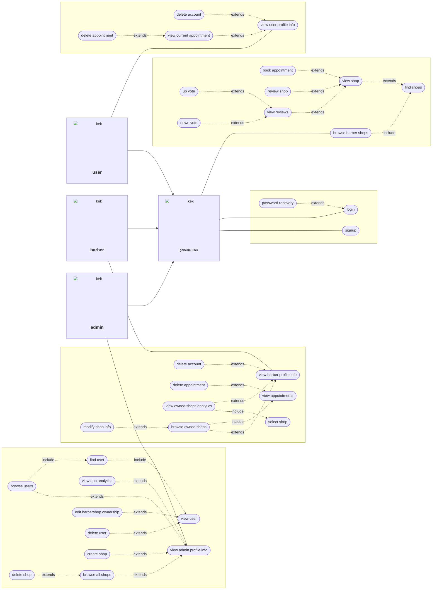

# Use-case diagram

```mermaid
flowchart LR

%% users
generic_user["<div style='width:200px;height:250px'><img src='stick.png' alt='kek'><h5 style='position:absolute;bottom:0px;text-align:center;width:100%;'>generic user</h5></div>"]

logged_user["<div style='width:200px;height:250px'><img src='stick.png' alt='kek'><h3 style='position:absolute;bottom:0px;text-align:center;width:100%;'>user</h3></div>"]

barber_user["<div style='width:200px;height:250px'><img src='stick.png' alt='kek'><h3 style='position:absolute;bottom:0px;text-align:center;width:100%;'>barber</h3></div>"]

admin_user["<div class='admin' style='width:200px;height:250px'><img src='stick.png' alt='kek'><h3 style='position:absolute;bottom:0px;text-align:center;width:100%;'>admin</h3></div>"]


%% user definitions
logged_user --> generic_user
barber_user --> generic_user
admin_user --> generic_user

%% admin profile
admin_user --- view_admin_profile_info
subgraph  
	%% entities
	find_user([find user])
	user_analytics([view app analytics])
	browse_all_shops([browse all shops])
	view_admin_profile_info([view admin profile info])
	modify_perm([edit barbershop ownership])
	delete_user([delete user])
	view_user([view user])
	browse_users([browse users])
	delete_shop([delete shop])
	create_shop([create shop])

	%% relations
	modify_perm-.extends.->view_user
	find_user -.include.->view_user
	browse_users -.include.-> find_user
	delete_user-.extends.->view_user
	delete_shop -.extends.->browse_all_shops

	user_analytics-.extends.->view_admin_profile_info
	create_shop-.extends.->view_admin_profile_info
	browse_all_shops-.extends.->view_admin_profile_info
	browse_users-.extends.->view_admin_profile_info
end


%% browse shops subgraph
generic_user ---- browse_shops
subgraph  
	%% entities
	find_shops([find shops])
	booking([book appointment])
	up_vote([up vote])
	down_vote([down vote])
	browse_shops([browse barber shops])
	view_shop([view shop])
	review([review shop])
	view_reviews([view reviews])

	%% relations
	view_shop -.extends.-> find_shops
	booking -.extends.-> view_shop
	up_vote-.extends.->view_reviews
	view_reviews-.extends.-> view_shop
	review -.extends.-> view_shop
	down_vote-.extends.->view_reviews
	browse_shops -.include.-> find_shops
end


%% barber profile

barber_user ---- view_barber_profile_info
subgraph  
	view_barber_profile_info([view barber profile info])
	select_shop([select shop])
	browse_owned_shops([browse owned shops])
	del_barber_acc([delete account])
	delete_appointment([delete appointment])
	browse_owned_shops -.include.-> view_appointments
	view_shop_analytics([view owned shops analytics])
	view_appointments([view appointments])

	browse_owned_shops -.extends.->view_barber_profile_info
	delete_appointment -.extends.-> view_appointments
	modify_shop -.extends.->browse_owned_shops
	view_shop_analytics -.extends.->view_barber_profile_info
	view_shop_analytics -.include.-> select_shop

	modify_shop([modify shop info])


	del_barber_acc-.extends.->view_barber_profile_info
end


%% user profile
logged_user ---- view_profile_info
subgraph  
	%% entities
	view_profile_info([view user profile info])
	del_acc([delete account])
	del_cur_appointment([delete appointment])
	curr_appointment([view current appointment])
	
	%% relations

	del_acc -.extends.->view_profile_info
	del_cur_appointment-.extends.->curr_appointment
	curr_appointment -.extends.->view_profile_info
end


%% login subgraph
generic_user ---- login
generic_user ---- signup

subgraph  
	login([login])
	signup([signup])
	pswd_rec([password recovery])
	pswd_rec -.extends.->login
end

%% colors
class del_barber_acc barber
class view_barber_profile_info barber
class view_admin_profile_info admin
class browse_owned_shops barber
class login all
class signup all
class modify_shop barber
class up_vote all
class down_vote all
class dis_reviews barber
class barber_user barber
class view_appointments barber
class view_shop_analytics barber
class select_shop barber
class delete_appointment barber
class delete_shop admin
class delete_review admin
class browse_users admin
class find_user admin
class view_user admin
class delete_user admin
class modify_perm admin
class create_shop admin
class user_analytics admin
class curr_appointment user
class view_profile_info user
class pswd_rec all
class del_cur_appointment user
class del_acc user
class browse_shops all
class find_shops all
class view_shop all
class view_reviews all
class review all
class booking user
class browse_all_shops admin

%% user colors
class generic_user nil
class logged_user user
class barber_user barber
class admin_user admin

```
